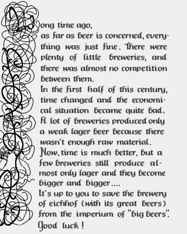
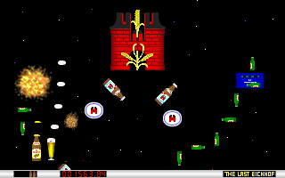
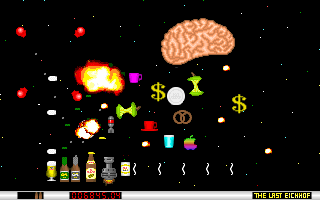

# The Last Eichhof

> from [web.archive.org](https://web.archive.org/web/20030402174954/http://ife.ethz.ch/~ammann/alphahelix/eichhof/)

Originally, we wanted to include just a tiny little shoot 'em up game into a graphics demo (we produced quite a few in the early years). As we've put quite a lot of effort into this, we decided to work a little harder on it and turn it out as a freeware game. Actually, it's more a sort of a party game. Instead of fighting against spaceships (as in other conventional shoot 'em up games), you have to shoot beer bottles, barrels, whisky glasses, aspirin pills and so on. As we grew up in the middle of Switzerland (ZUG, Innerschweiz), we first started drinking EICHHOF beer (you could also say we grew up with this beer !!). The kind of beer you started with is mostly the beer you like best, as you probably know, and so we decided to dedicate our game to the good old Brewery of Eichhof in Luzern. We also think that you shouldn't support the very big breweries (I guess you know which breweries we mean) and that's why we also built up a little background story for this game.

- In the first screenshot, you can see the end monster of level #1 ("Feldschloesschen"). Feldschloesschen is the biggest brewery in Switzerland, so this level is dedicated to them.

- Level #2 is called "Weissbier" and is dedicated to all the beers in BAYERN.
- Level #3 is about all the other booze (cocktails, whiskey, and so on).
- In the final level, you have to fight against all the things we need every sunday morning (alka-seltzer-pills, mineral water, coffee, toilet ..)
- Below, you can see the end level monster of the final level. The big brain stands, of course, for all the terrible headaches we have sometimes.

Our game was available on quite a few sites and it was amazing how many people wrote us postcards or mailed us. At this place, we want to thank you all for that.

## Sub Dirs

- [Original Source Code](beer_src/) from [ftp.lanet.lv](http://ftp.lanet.lv/ftp/mirror/x2ftp/msdos/programming/gamesrc/beersrc.zip)
- [Original Binary](beer_exe/) from [web.archive.org](https://web.archive.org/web/20030402174954/http://ife.ethz.ch/~ammann/alphahelix/eichhof/)
- [Allegro Port Source Code](allegro_src/) from [sourceforge.net](https://sourceforge.net/projects/lasteichhof/)
